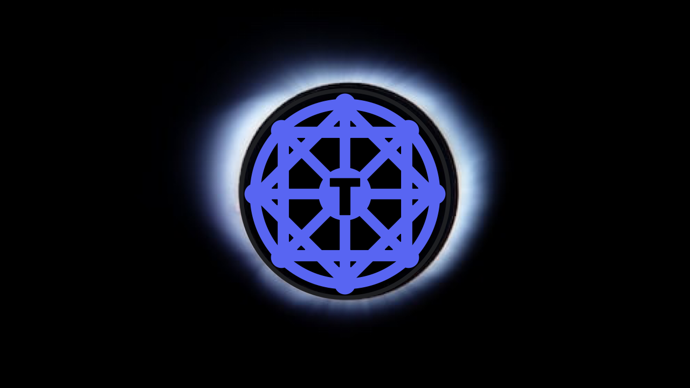

# About Us
Our community began with random truth seekers coming together on X to discuss the physics concerning Earth. 🌎

Thanks to the  work of individuals who conducted countless hours of research into the core, scientific and philosophical tenets driving today's physics community, we've been able to collectively attain a deeper level of understanding about these things. We now know there are a number of fundamental issues that have led science off in directions away from the truth of our reality and we seek to offer whatever we can to contribute toward the cause of discovering a much more accurate, concrete model of Earth and its surroundings.

# Our Mission
Our overall goal is to develop a worldwide network of individuals willing to join us in that pursuit by engaging in a process of proposing, selecting, funding, and executing experiments. Then, armed with the resulting sets of data, helping us create the truest model of what we live on and that resides within, so we can share it with the world.

If this sounds like something you're interested in contributing to, we'd be happy to welcome you into _Truthers Foundation_.
